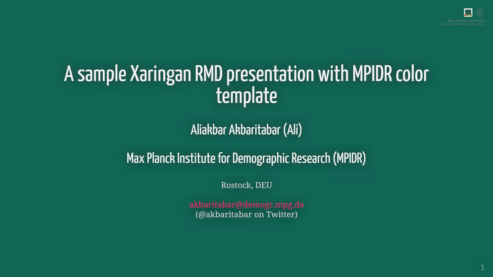
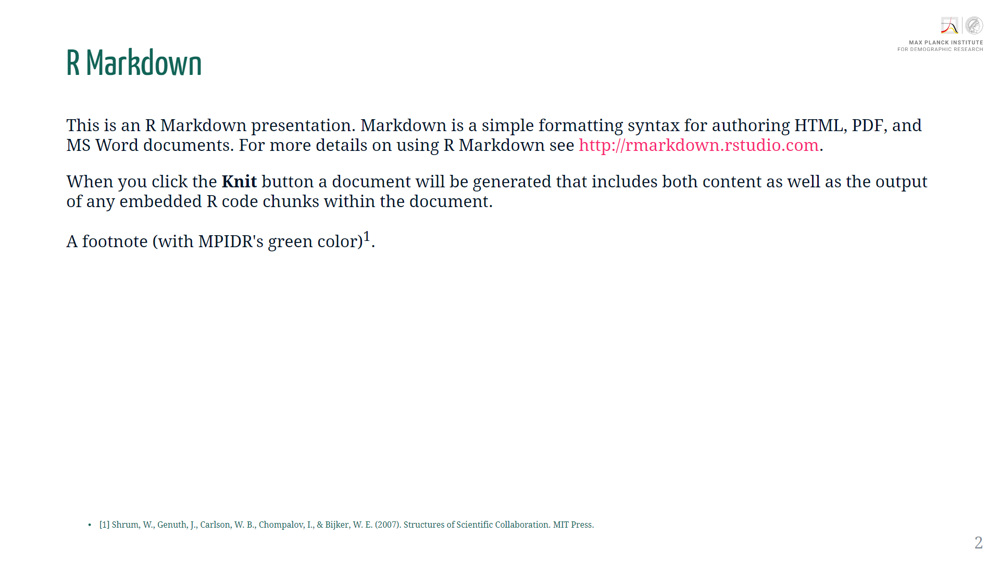

# MPIDR-Xaringan-presentation
A simple example of Rmarkdown (RMD) presentation using Xaringan, trying to adopt MPIDR's colour schemes

## See slides
Here: [https://akbaritabar.github.io/MPIDR-Xaringan-presentation/RMD_presentation_with_MPIDR_colors.html#1](https://akbaritabar.github.io/MPIDR-Xaringan-presentation/RMD_presentation_with_MPIDR_colors.html#1)

## Credit
- "libs/macros.js" and some settings copied from [here](https://github.com/earowang/rladiesakl20) (Thanks)

## How does it look like?!

